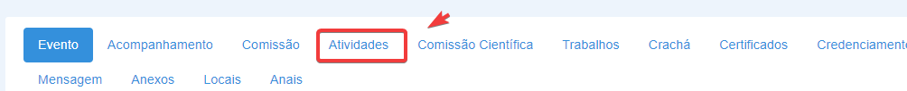
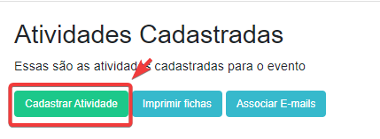

## Como criar uma atividade no Pharus
A criação de atividades no sistema pharus é destinado apenas aos usuários que exercem o papel de organizador no site. 
Para cadastrar uma atividade é necessário que antes disso um evento tenha sido criado. Além disso definir a data e o local o qual será realizada é importante, a fim de divulgar as informações corretas e claras.
## Acessando opção de eventos
Utilizando o menu lateral esquerdo, acesse a página onde mostra todos os cursos gerenciados. Siga as instruções abaixo:

1.No menu lateral Esquerdo, clique em "Participante"

2.No menu subjacente que abrirá, clique em "Organizador"

3.Clique em "Eventos"

## Cadastrando atividade
1.Na barra de tarefas mostrada a seguir  selecione a opção "Atividades"

2. A seguir clique em "Cadastrar atividade"

Na página de criação de atividade, você poderá registrar as informações necessárias. Vamos configurar a primeira parte do cadastro de uma nova atividade dentro do sistema PHARUS.

3. Vamos configurar a primeira parte do cadastro de uma nova atividade dentro do sistema PHARUS.
    - **1 Título da atividade:*** Insira o título da atividade no campo correspondente.
    - **2 Tipo da atividade:*** Ao clicar em "tipo" selecione o tipo de atividade correspondente.
    - **3 Número de vagas :*** Insira o número de vagas disponivéis para a atividade.
    - **4 Data de início das atividades:*** Insira a data de início das atividades no formato "mm/dd/yyyy".
    - **5 Data de termino das atividades:*** Insira a data de termino das atividades no formato "mm/dd/yyyy".
    - **6 Local:*** Insira o local que será realizado as atividades.Exemplo: IFNMG - Campus Almenara.
    - **7 Hora que inicia:*** Insira o horário de início das atividades.
    - **8 Término das inscrições nas atividades:*** Insira a data de término das inscrições nas atividades no formato "mm/dd/yyyy".
    - **9 Carga horária:*** Insira a carga horária total do evento.
    - **10 Dias:*** Insira a quantidade de dias que a atividade irá durar.

    

4.Descendo a página de cadastro de atividades há apenas alguns campos à serem preenchidos 
   - **11 Inscrição:*** Selecione a opção coerente a atividade proposta, isto é se ela vai requerer dos participantes uma inscrição ou não.
    - **12 Descrição:*** Nesse espaço fale resumidamente sobre a atividade cadastrada.
    - **13 Link:*** Insira o link de acesso a atividade.
    - **14 Salvar:** Clique em "Salvar" e a atividade estará cadastrada no pharus.

    